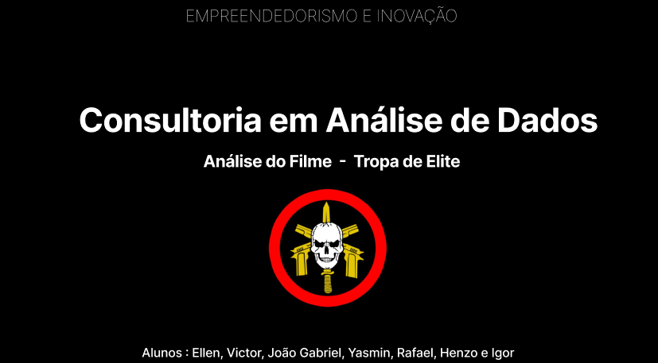

# 🎬 Tropa de Elite — Análise Crítica

> Desenvolvido em apenas uma semana, o trabalho foi apresentado para uma avaliadora de filmes e marcas.

---

  

    
  

## 📌 Sobre o Projeto

Este projeto foi desenvolvido por alunos do **SENAC** com o objetivo de realizar uma análise aprofundada do filme **Tropa de Elite**. A pesquisa foi conduzida com base em um formulário criado e compartilhado pelo próprio grupo, reunindo percepções, opiniões e dados de múltiplos respondentes para embasar a análise final.

---

## 🛠️ Tecnologias Utilizadas

### 🔷 Power BI + Power Query
Utilizado para o **tratamento e limpeza dos dados** oriundos do formulário coletivo, além da criação de dashboards de apoio à análise.

### 🐍 Python
Utilizado para a criação dos **dashboards principais e mais elaborados**, com as seguintes bibliotecas:

| Biblioteca | Uso |
|---|---|
| `pandas` | Manipulação e análise de dados |
| `seaborn` | Visualizações estatísticas |
| `matplotlib` | Geração de gráficos e plots |

---

## 📊 Em Números

| | |
|---|---|
| ⏱️ Prazo | 1 semana |
| 🎥 Filme analisado | Tropa de Elite |
| 👥 Metodologia | Formulário coletivo do grupo |
| 🎯 Apresentado para | Avaliadora de filmes e marcas |

---

## ✅ O Que Foi Feito

- [x] Criação e distribuição de formulário de pesquisa coletiva
- [x] Coleta e tratamento dos dados via **Power BI / Power Query**
- [x] Criação de dashboards de apoio no **Power BI**
- [x] Desenvolvimento dos dashboards principais com **Python** (pandas, seaborn, matplotlib)
- [x] Análise do filme *Tropa de Elite* sob múltiplas perspectivas
- [x] Elaboração de apresentação final para avaliadora de filmes e marcas

---

## 🎯 Objetivo

Apresentar uma análise crítica e fundamentada do filme *Tropa de Elite*, explorando aspectos narrativos, de marca e impacto cultural, com base em dados reais coletados pelo grupo — entregue dentro do prazo estabelecido pela instituição.

---

## 👥 Equipe

Trabalho desenvolvido em grupo por alunos do **SENAC**.

---

*Projeto Acadêmico · SENAC · Análise Cinematográfica*
